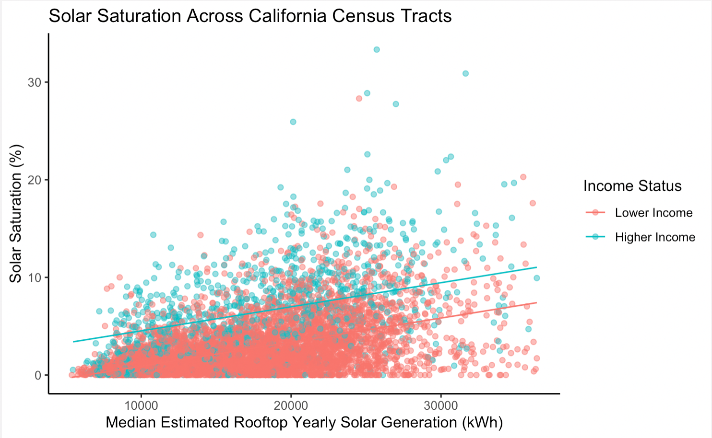

```{r Setup, include = F}
options(htmltools.dir.version = FALSE)
library(pacman)
p_load(leaflet, ggplot2, ggthemes, viridis, dplyr, magrittr, knitr,pagedown,cowplot,latex2exp)
# Define pink color
red_pink <- "#e64173"
# Knitr options
opts_chunk$set(
  comment = "#>",
  fig.align = "center",
  fig.height = 7,
  fig.width = 10.5,
  # dpi = 300,
  # cache = T,
  warning = F,
  message = F,
  dev = "svg"
)
# A blank theme for ggplot
theme_empty <- theme_bw() + theme(
  line = element_blank(),
  rect = element_blank(),
  strip.text = element_blank(),
  axis.text = element_blank(),
  plot.title = element_blank(),
  axis.title = element_blank(),
  plot.margin = structure(c(0, 0, -1, -1), unit = "lines", valid.unit = 3L, class = "unit"),
  legend.position = "none"
)
theme_simple <- theme_bw() + theme(
  line = element_blank(),
  panel.grid = element_blank(),
  rect = element_blank(),
  strip.text = element_blank(),
  axis.text.x = element_text(size = 14),
  axis.text.y = element_blank(),
  axis.ticks = element_blank(),
  plot.title = element_blank(),
  axis.title = element_blank(),
  # plot.margin = structure(c(0, 0, -1, -1), unit = "lines", valid.unit = 3L, class = "unit"),
  legend.position = "none"
)
```


name: Overview
# **Some Well Known Pros of Rooftop Solar**

```{r, out.width = "70%", echo=FALSE, fig.align='center'}

```
---
# **Some Well Known Pros of Rooftop Solar**

```{r, out.width = "70%", echo=FALSE, fig.align='center'}

```

- **It's clean**

---
# **Some Well Known Pros of Rooftop Solar**

```{r, out.width = "70%", echo=FALSE, fig.align='center'}

```
- It's clean

- **It helps you save money**

---
layout: false
class: clear, middle, inverse
# **Some Lesser Known Cons of Rooftop Solar**
---
# **Some Lesser Known Cons of Rooftop Solar**
### (1) Solar Is Less Accessible to Lower Income Households
```{r, echo = FALSE}
library(DiagrammeR)
DiagrammeR::grViz("digraph {

graph [layout = dot, rankdir = LR]

# define the global styles of the nodes. We can override these in box if we wish
node [shape = rectangle, style = filled, fillcolor = Linen]

accessissue1 [label = 'high upfront costs', fillcolor = Beige]
accessissue2 [label = 'must opt in', fillcolor = Beige]
accessissue3 [label = 'rentership barriers', fillcolor = Beige]
lessaccess [label =  'lower accessibility for \n low income (LI) households', fillcolor = Beige]
results [label= 'missed monetary savings \n for LI households']

# edge definitions with the node IDs
{accessissue1 accessissue2 accessissue3}  -> lessaccess -> results
}")
```

---
# **Some Lesser Known Cons of Rooftop Solar**
### (2) More Cost Shifts to Those Without Solar
```{r, echo = FALSE}
library(DiagrammeR)
DiagrammeR::grViz("digraph {

graph [layout = dot, rankdir = LR]

# define the global styles of the nodes. We can override these in box if we wish
node [shape = rectangle, style = filled, fillcolor = Linen]

costissue [label = 'households with solar sell back \n at a retail price point', fillcolor = Beige]
cost [label = 'cost shift to \n those without solar', fillcolor = Beige]
results [label = 'monetary costs to \n those without solar']

# edge definitions with the node IDs
costissue -> cost -> results
}")
```

---
layout: false
class: clear, middle, inverse
# **Study Objective**
## Given this, I wanted to take a look at the relationship between income and solar adoption across (1) the whole **United States**, and (2) in **California**, since solar policy reform is underway to help lessen this issue.  
---
layout: false
class: clear, middle, inverse
# **Data Sources**
---
# **Data Sources**

- **Solar Data** found [here](https://sunroof.withgoogle.com/data-explorer/featured/1/oklahoma-city) is from Google Project Sunroof which uses Google overhead imagery, weather station data, and machine learning algorithms to estimate rooftop solar potential of all buildings within the US

- **Income Data** found [here](https://www.ffiec.gov/censusapp.htm) is from the Federal Financial Institutions Examination Council (FFIEC) and maintains income-related census data available for download
---
layout: false
class: clear, middle, inverse
# **Regression: California Case Study**
---
# **Regression: California Case Study**
- Equation: $$pctsolarsat_i=-1.565 + 0.0002466 \cdot solargen_i + 3.622 \cdot income_i + \varepsilon_i$$
- Adjusted R<sup>2</sup>: 0.3599
- p-value: < 2.2e-16
```{r, out.width = "70%", echo=FALSE, fig.align='center'}

```
---
layout: false
class: clear, middle, inverse
# **Hypothesis Testing: California Case Study**
---
# **Hypothesis Testing: California**
## Solar Saturation 
### Hypotheses:
- Null Hypothesis: The true difference in mean solar saturation between lower income and higher income census tracts is equal to 0.
- Alternative Hypothesis: The true difference in mean solar saturation between lower income and higher income census tracts is not equal to 0.
---
# **Hypothesis Testing: California**
## Solar Saturation
### Hypotheses:
- Null Hypothesis: The true difference in mean solar saturation between lower income and higher income census tracts is equal to 0.
- Alternative Hypothesis: The true difference in mean solar saturation between lower income and higher income census tracts is not equal to 0.

### Results:
- lower income mean solar saturation: **2.62%** saturated
- higher income mean solar saturation: **6.65%** saturated
- 95% confidence interval: **3.64% - 4.22%** difference in means
- p-value: < **2.2e-16**
---
# **Hypothesis Testing: California**
## Number of Buildings
### Hypotheses:
- Null Hypothesis: The true difference in mean buildings with solar between lower income census tracts and higher income census tracts is equal to 0.
- Alternative Hypothesis: The true difference in mean buildings with solar between lower income census tracts and higher income census tracts is not equal to 0.
---
# **Hypothesis Testing: California**
## Number of Buildings
### Hypotheses:
- Null Hypothesis: The true difference in mean buildings with solar between lower income census tracts and higher income census tracts is equal to 0.
- Alternative Hypothesis: The true difference in mean buildings with solar between lower income census tracts and higher income census tracts is not equal to 0.

### Results:
- lower income mean buildings with solar: **26** buildings
- higher income mean buildings with solar: **54** buildings
- 95% confidence interval: **25 - 30** difference in means
- p-value: < **2.2e-16**
---
# **What does it all mean?**
###Bad News:
- this means we see more affluent neighborhoods with solar
---
# **What does it all mean?**
###Bad News:
- this means we see more affluent neighborhoods with solar

###Good News:
- there is still a lot of potential for rooftop solar!
- if we reform policy correctly, we can facilitate equitable solar and cleaner energy
---
# **Thanks for Listening!**

## Check out my [blog post](https://victoriacutler.github.io/posts/2022-12-04-22-solar-equity/) on 12/9 (but don't judge my website) for more details and analyses 

- Slides created via the R package [**xaringan**](https://github.com/yihui/xaringan).

- Slide template was borrowed from [Tamma Carleton's](https://github.com/tcarleton/EDS-222-stats) github for our EDS222 course materials.

---
exclude: true

```{R, print pdfs, echo = F, eval = F}
pagedown::chrome_print(
  input = "solarinequity_ppt.html",
  output = "solarinequity_ppt.pdf",
  timeout = 60
)
```